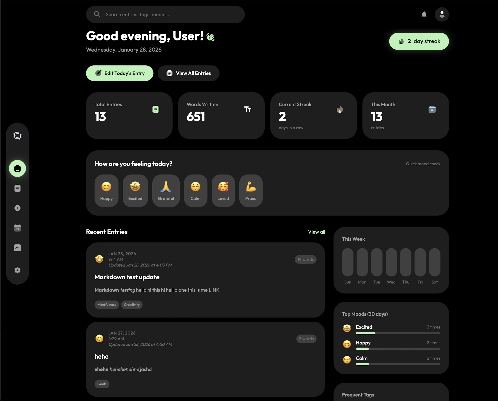

# Reflecta



A cross-platform journaling + mood tracking app built with **.NET MAUI Blazor Hybrid**.

Reflecta focuses on a simple daily writing flow, mood selection, tags, streaks, analytics, and export (HTML/Markdown/PDF/Text).

## Features

- Daily journal entries (title + rich text/markdown-friendly content)
- Mood tracking (primary + optional secondary moods)
- Tagging (system + custom tags, optional categories)
- Streak tracking
- Analytics dashboards (charts)
- App lock options (PIN + optional biometrics)
- Export journal entries to **HTML**, **Markdown**, **Plain Text**, or **PDF** (QuestPDF)

## Tech Stack

- **.NET MAUI** + **Blazor Hybrid** UI
- **Entity Framework Core** + **PostgreSQL (Npgsql)**
- **Tailwind CSS** (compiled to `wwwroot/app.css`)
- **Markdig** (Markdown)
- **QuestPDF** (PDF export)
- **Blazor-ApexCharts** (charts)

## Project Layout

- `Reflecta/` – MAUI app project
  - `Components/` – Blazor UI (pages/layout/shared components)
  - `Services/` – app services (auth, journal, analytics, export, lock, settings, etc.)
  - `Data/` – EF Core DbContext + seeding + migrations
  - `Models/` – entity models
  - `wwwroot/` – web assets (Tailwind pipeline, CSS, static files)

## Prerequisites

### Required

- **.NET SDK 10**
- **MAUI workload**
  - `dotnet workload install maui`
- **PostgreSQL 14+** (local or remote)

### Optional (for styling)

- **Node.js 18+** (for Tailwind build/watch)

### Platform-specific

- **Android**: Android SDK (usually via Android Studio)
- **iOS / MacCatalyst**: Xcode
- **Windows**: Windows 10+ (only on Windows host)

## Configuration

### Database connection

Reflecta uses PostgreSQL.

The connection string is resolved in this order:

1. `ConnectionStrings:DefaultConnection` from `Reflecta/appsettings.json` (embedded)
2. `REFLECTA_CONNECTION_STRING` environment variable
3. Fallback: `Host=localhost;Port=5432;Database=reflecta_db;Username=<your_os_username>`

Recommended for local dev: set `REFLECTA_CONNECTION_STRING` so you can include a password.

macOS / zsh:

```bash
export REFLECTA_CONNECTION_STRING='Host=localhost;Port=5432;Database=reflecta_db;Username=reflecta;Password=reflecta'
```

Windows PowerShell:

```powershell
$env:REFLECTA_CONNECTION_STRING = "Host=localhost;Port=5432;Database=reflecta_db;Username=reflecta;Password=reflecta"
```

### Postgres via Docker (quick start)

```bash
docker run --name reflecta-postgres \
  -e POSTGRES_USER=reflecta \
  -e POSTGRES_PASSWORD=reflecta \
  -e POSTGRES_DB=reflecta_db \
  -p 5432:5432 \
  -d postgres:16
```

Then set `REFLECTA_CONNECTION_STRING` to:

```text
Host=localhost;Port=5432;Database=reflecta_db;Username=reflecta;Password=reflecta
```

Note for simulators/emulators:

- Android emulator: use `Host=10.0.2.2` to reach your host machine.
- iOS simulator: `Host=localhost` usually works for services on the Mac host.
- Physical devices: use your machine’s LAN IP or a reachable DB host.

## Build & Run

From the repository root:

```bash
dotnet restore
```

### MacCatalyst (macOS)

```bash
dotnet build Reflecta/Reflecta.csproj -t:Run -f net10.0-maccatalyst
```

### Android

```bash
dotnet build Reflecta/Reflecta.csproj -t:Run -f net10.0-android
```

### iOS (macOS + Xcode)

```bash
dotnet build Reflecta/Reflecta.csproj -t:Run -f net10.0-ios
```

### Windows (Windows host only)

```powershell
dotnet build Reflecta/Reflecta.csproj -t:Run -f net10.0-windows10.0.19041.0
```

## Database & Migrations

- Migrations live in `Reflecta/Data/Migrations/`.
- The app attempts to run `dbContext.Database.Migrate()` automatically at startup.
- A design-time factory (`ReflectaDbContextFactory`) is included so EF CLI works with MAUI.

Common commands:

```bash
# Install/update EF CLI tool if needed
# (Version should match the EF Core major used by the project)
dotnet tool update -g dotnet-ef --version 9.*

# Apply migrations
cd Reflecta
REFLECTA_CONNECTION_STRING='Host=localhost;Port=5432;Database=reflecta_db;Username=reflecta;Password=reflecta' \
  dotnet ef database update

# Add a migration
REFLECTA_CONNECTION_STRING='Host=localhost;Port=5432;Database=reflecta_db;Username=reflecta;Password=reflecta' \
  dotnet ef migrations add YourMigrationName
```

## Tailwind / CSS

The Tailwind pipeline lives in `Reflecta/wwwroot/`.

```bash
cd Reflecta/wwwroot
npm install

# One-time build
npm run build:css

# Watch during development
npm run watch:css
```

## Demo Data

On startup, demo entries are seeded **only if** a demo user exists:

- Demo email: `user@demo.com`

## Troubleshooting

- **Database connection errors**: confirm Postgres is running and `REFLECTA_CONNECTION_STRING` is reachable from the target platform (emulators often can’t use `localhost`).
- **Android can’t reach host Postgres**: use `Host=10.0.2.2`.
- **PDF export issues on MacCatalyst**: the app includes a bootstrapper that loads the QuestPDF native dylib at runtime; if you hit native-load errors, try a clean rebuild and ensure the app has access to its app data directory.

## Security Notes

- Don’t commit real secrets into `Reflecta/appsettings.json`.
- Prefer environment variables for connection strings and any sensitive config.

## License

No license file is included in this repository yet. Add a `LICENSE` file if you plan to distribute this project.

NOTE: This project was developed as part of my college coursework, and I have decided to make it open-source. You are welcome to use, modify, or build upon it in any way you see fit.
